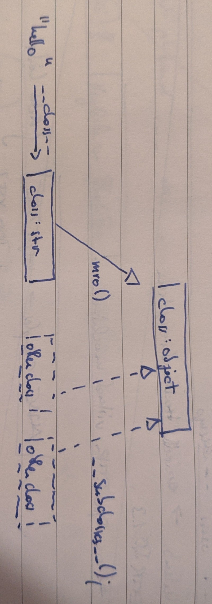

# Black-, Grey-, White-Box Pen-Tests

## Unterschied zu Black-Box

* source code kann gelesen werden
* weniger "Detektivarbeit"
* keine "Verdachtsmomente"
* Standards/Normen wie z. B. ÖNORM A77.00
* Zeitaufwand weitaus höher

## Typische Tools: Old-School

* grep
* vim (or other editor)
* increase logging in virtual machine

## Typische Tools Next-Generation

* [semgrep](https://semgrep.dev)
* Visual Studio Code (for debugging)
* Automated Scanning / SAST (corporate)

# Example

## Vulnerable Software

* [ERPnext](https://www.erpnext.com)
* [Open Source ERP](https://github.com/frappe/erpnext)
* based upon [Frappe Framework](https://github.com/frappe/frappe)
* uses [bench for orchestration](https://github.com/frappe/bench)

## Grund-Setup

* VM mit Source Code
* quasi eine Kopie der Software
* nicht mit Echtdaten (aber korrektem Schema)
* db logging ist aktiviert (`/etc/mysql/my.cnf`)

# Example: Architecture

## MVC


## Metadata-based Programming

## Quick Look through the Application Structure

## First read through the code

* search for MVC-Patterns
* how is authorization handled?

# Try to exploit SQLi

## Find vulnerable Operations

* what would make for a vulnerable function?

## Deja-Vu: UNION Based Select

~~~ sql
select name, email from users
union
select 1, password from othertable;
~~~

* Kommentar in MySQL: #
* Version in Mysql: @@version

## Got SQLi, what now?

* what can I do with what I found?
* collation

## Got SQLi, Hashes seem to be secure

find another way..

# Try to Exploit SSTI/RCE

## What now?

* template injection to RCE..
* what are templates?
* what do I want to execute?

## Jinja2 Templates?

``` html

	<li><a href="{{ item.href }}">{{ item.caption }}</a></li>


{# title(striptags(name)) #}
{{ name|striptags|title }}

```

* [More Information for Template Language](https://jinja.palletsprojects.com/en/2.11.x/templates/)

## Python: Inheritance



## Python: Inheritance

```python
"fubar".__class__.mro()[1].__subclasses__()[40]("abc").some_method()
```

| Method/Attribute | Description |
| :--              | :--         |
| `__class__`      | instance object's class |
| `mro()`          | All parent classes of a class |
| `__subclasses__` | All currently known subclasses of a class |
| `class("abc")`   | Create instance of class with Parameter abc | 

## Python: Illegal Template?

[List of bypasses](https://www.onsecurity.io/blog/server-side-template-injection-with-jinja2/)

## Exploit

# Comparision to Black-Box Testing (IMHO)?

* zielgerichteter, weniger raten.
* tooling: OSS lacking, expensive
* more expensive?
